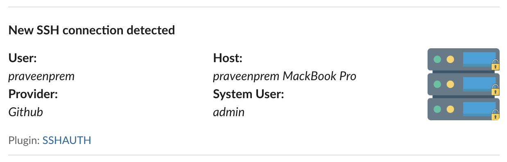

# Notification Service configuration
Notification service can be configured to provide push notification on user authentication attempts to a server. 

Below are a list of notification service providers, currently supported by NexusAuth.

> Keys `notification` is the same keys also listed in the README.md.

- [Slack](#slack)
    - [Pre-requisite](#pre-requisite)
    - [Configuration](#configuration)
    - [Sample](#sample)
        - [Success](#success)
        - [Failure](#failure)

## Slack

Current version support alerting with [Slack Incoming Webhooks](https://api.slack.com/incoming-webhooks).

### Pre-requisite
- Incoming webhook for to the workspace. More information can be found [here](https://api.slack.com/messaging/webhooks).

### Configuration
- **service** - Notification provider name. `slack`
- **url** - Webhook to post the alert to.

### Sample
```json
    "notification": {
        "service": "slack",
        "url": "https://hooks.slack.com/services/XXXXX/YYYYYYYY/ZZZZZZZZZZZZZZZZZ"
    }
```
### Sample notifications
All login attempts will have one of the following results.

#### Success

#### Failure

